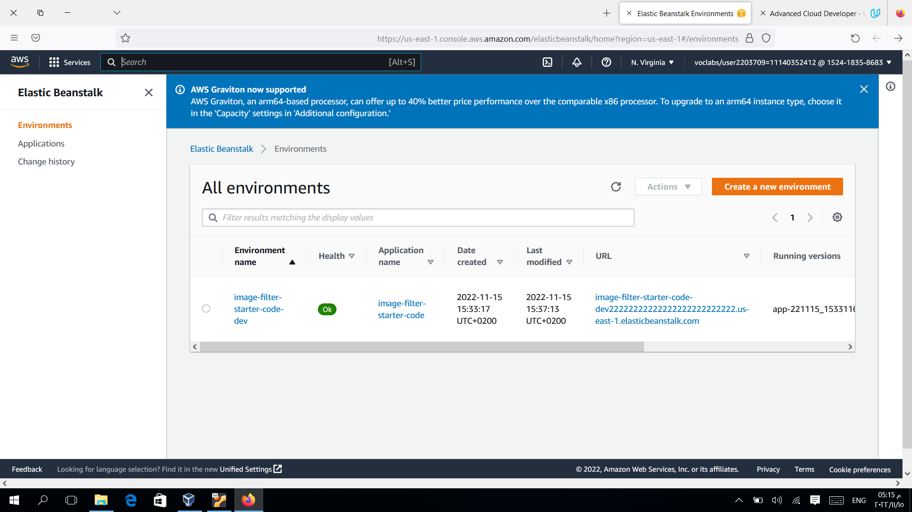
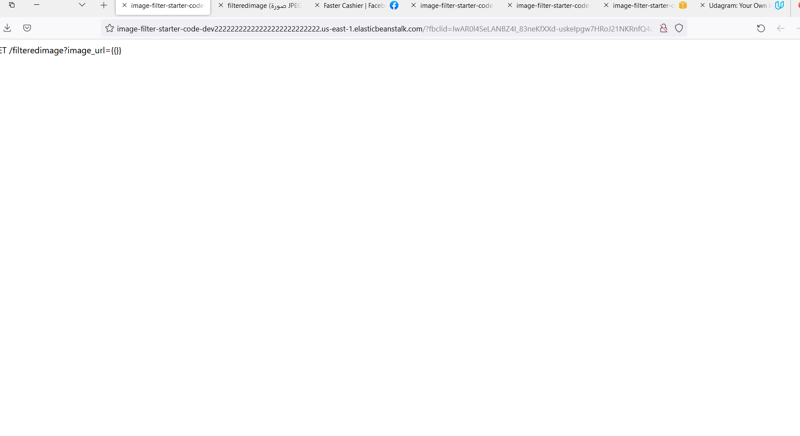
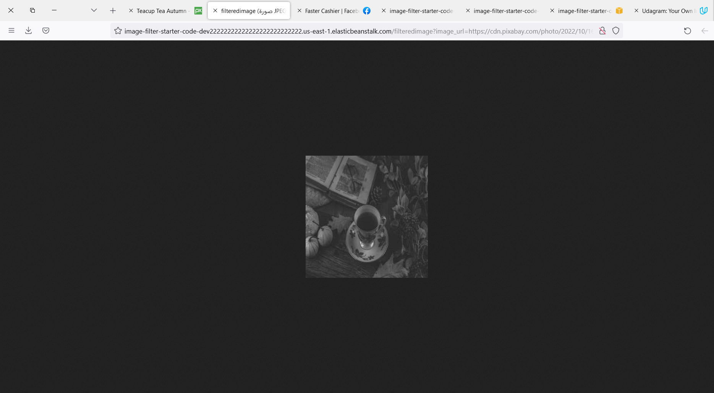

# Udagram Image Filtering Microservice

## Tasks

### Setup Node Environment

# URL
http://image-filter-starter-code-dev22222222222222222222222222.us-east-1.elasticbeanstalk.com/

### Deploying your system

Follow the process described in the course to `eb init` a new application and `eb create` a new environment to deploy your image-filter service! Don't forget you can use `eb deploy` to push changes.

